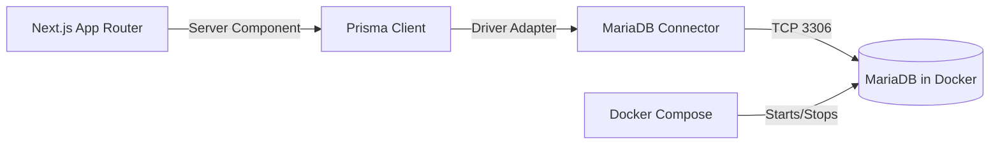
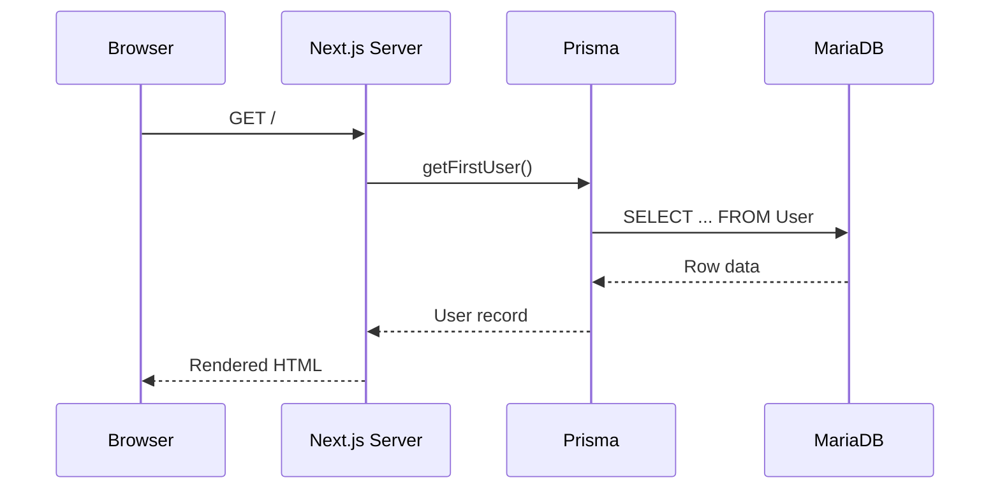

# Stack Overview

## Components

- **Next.js (App Router)**: Server components render the UI and perform server-side data fetching.
- **Prisma ORM**: Type-safe data access layer.
- **MariaDB**: Relational database running in Docker.
- **Docker Compose**: Local MariaDB orchestration.

## How They Connect

Prisma uses the MariaDB driver adapter to connect to the database via `DATABASE_URL`, which is derived from `DB_*` environment variables in `.env`. The Next.js server component calls Prisma to read data, then renders the UI.

## Request Flow (Read)

## Seeded Data

Seeding is done via `prisma db seed` using `/Users/charlys/Documents/dev/urana/prisma/seed.ts`. The frontend reads the first user from the database to prove end-to-end connectivity.

## Notes

- `DATABASE_URL` is derived from `DB_*` values in `.env`.
- The MariaDB container is managed by `/Users/charlys/Documents/dev/urana/docker-compose.yml`.
